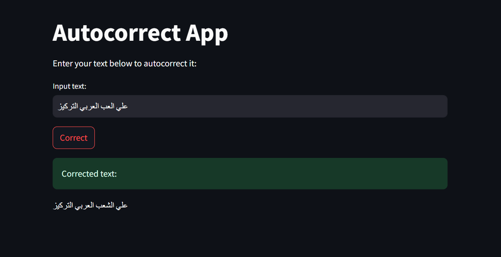

# Arabic Auto-Correction using Deep Learning

This project focuses on correcting spelling and typing errors in Arabic text using deep learning models. It features an LSTM-based sequence-to-sequence model and a Transformer-based model (Twhin-BERT-Large). A Streamlit web app is included for real-time demo and interaction.

---

## 📌 Overview

The goal of this project is to enhance Arabic text quality by automatically detecting and correcting errors. It supports both formal and informal Arabic content, using deep learning to handle a wide variety of mistakes.

---

## 📚 Dataset

- **Source:** [Kaggle - Arabic Auto Correct Dataset](https://www.kaggle.com/datasets/muheshaam/arabic)
- **Structure:**  
  - `correct`: Correct Arabic sentences  
  - `incorrect`: Artificially generated incorrect versions
- **Preprocessing:**
  - Normalized Arabic characters (e.g., "أ" → "ا", "ة" → "ه")
  - Removed punctuation, digits, and non-Arabic characters
  - Added synthetic noise (insertion, deletion, swap, replace)

---

## 🧪 Data Preparation

- Tokenized with `Tokenizer` from Keras
- Padded sequences to a uniform length
- **Vocabulary size:** 100,808  
- **Maximum sequence length:** 394  
- **Splits:**
  - Train: 72%  
  - Validation: 18%  
  - Test: 10%

---

## 🧠 Model 1: LSTM-based Auto-Correction

- Architecture:
  - Embedding → LSTM → Dense with softmax
- Loss: `sparse_categorical_crossentropy`
- Optimizer: Adam
- Achieved **93.06%** accuracy on the test set
- Model saved as `arabic_auto_correction_model.h5`
- Tokenizer saved as `tokenizer.pkl`

---

## 🤖 Model 2: Transformer (Twhin-BERT-Large)

- Fine-tuned on masked language modeling (MLM) using Hugging Face Transformers
- Rare words in sentences are masked dynamically
- Trained with `Trainer` API and `DataCollatorForLanguageModeling`
- Helps correct context-sensitive words more accurately

---

## 🌐 Streamlit App

A web application was built with Streamlit to provide a user-friendly interface for real-time Arabic sentence correction.

### Features:
- Input incorrect Arabic text
- Display the corrected version instantly
- Easy to run and test locally

---

## 💻 Demo

Below is a screenshot from the Streamlit interface:

